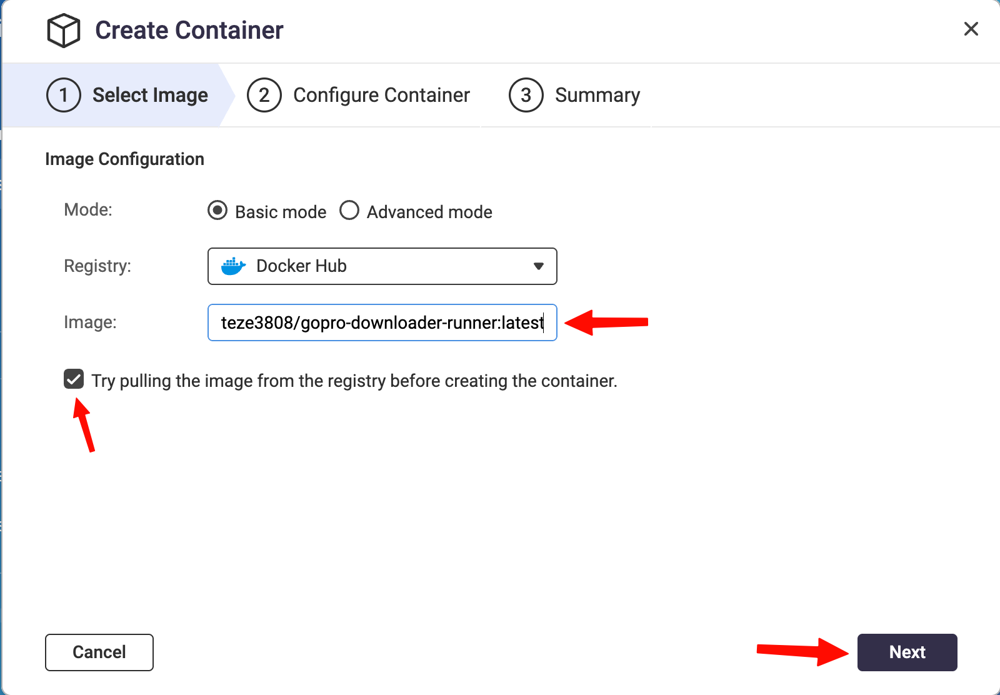
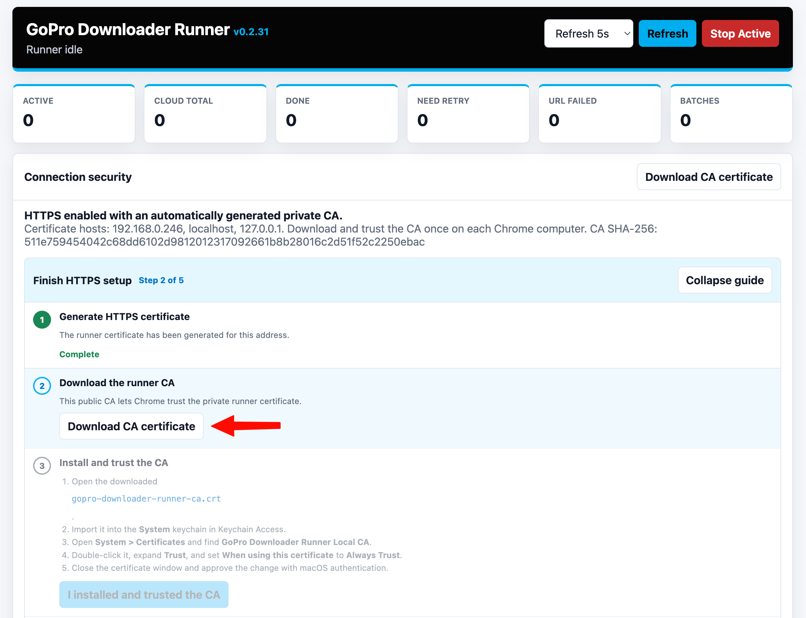
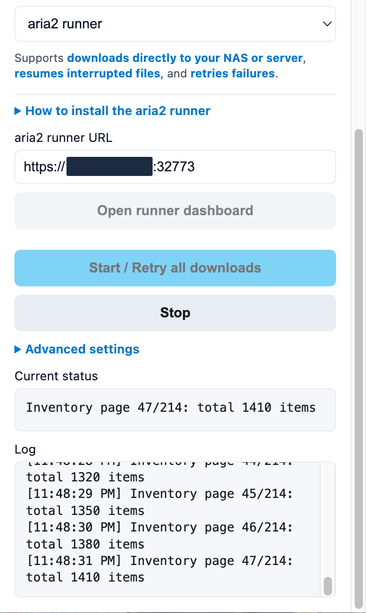

# GoPro Downloader Support

GoPro Downloader helps users download media from their own GoPro Cloud Media Library through Chrome or an optional local/NAS runner.

This is an independent community project. It is not affiliated with, authorized by, endorsed by, or produced by GoPro, Inc.

## Installation Guides

- [Install the aria2 runner with OrbStack or Docker Desktop on Mac, Docker Desktop on Windows, QNAP, or Synology](RUNNER_INSTALLATION.md)
- [GoPro Downloader Privacy Policy](PRIVACY.md)

## Visual Setup Guide

The full runner guide includes step-by-step screenshots for QNAP, Synology, HTTPS setup, Windows certificate installation, and connecting the Chrome extension.

[Open the complete runner installation guide](RUNNER_INSTALLATION.md)

### Install on a NAS

### Secure the Runner

### Start and Monitor Downloads

## Help and Feedback

Open the structured issue chooser and select the form that matches what you need:

- [Installation help](https://github.com/teze3808/gopro-downloader-support/issues/new/choose)
- [Bug report](https://github.com/teze3808/gopro-downloader-support/issues/new/choose)
- [Feature request](https://github.com/teze3808/gopro-downloader-support/issues/new/choose)

For installation help or a bug report:

1. Open the GoPro Downloader extension.
2. Expand `Advanced settings`.
3. Click `Help & feedback` to open the chooser.
4. Click `Copy support summary` and paste it into the selected form.
5. If requested, click `Download diagnostic log` and review the file before attaching it.

Do not include GoPro credentials, authentication cookies, temporary signed download URLs, private media filenames, or unreviewed private runner logs in a public issue.

## Privacy

Read the [GoPro Downloader Privacy Policy](PRIVACY.md).

## Support the Project

https://ko-fi.com/teze3808
